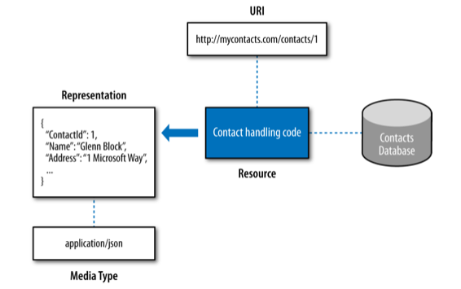

## How It Works

Under the hood, ASP.NET Web API is built around an asynchronous HTTP handler called `System.Web.IHttpAsyncHandler`. Handlers are classes that can intercept and handle HTTP requests made to the web server and respond to the client with the relevent response. 

```csharp
public interface IHttpAsyncHandler : IHttpHandler 
{ 
	System.IAsyncResult BeginProcessRequest(HttpContext context, System.AsyncCallback cb, object extraData); 
	void EndProcessRequest(System.IAsyncResult result); 
}

public class HttpControllerHandler : HttpTaskAsyncHandler 
{ 
	public HttpControllerHandler(RouteData routeData); 
	public HttpControllerHandler(RouteData routeData, HttpMessageHandler handler);
	public override Task ProcessRequestAsync(HttpContext context);
}
``` 

When you run both MVC and Web API in the same ASP.NET process, ASP.NET will use the `HttpApplication.MapRequestHandler` event to determine which of the HTTP handlers will be selected to handle the incoming request. At this stage, route matching happens, and the request flows through the `IRouteHandler` relevant for the selected route. The sole purpose of `IRouteHandler` is to produce an `IHttpHandler` that can handle the request.

If the `IRouteHandler` is `HttpControllerRouteHandler` (Web API route), then the Web API path will be chosen and the request will end up in the `HttpControllerHandler`. Conversely, if the route handler is `MvcRouteHandler`, then the MVC path takes over via `MvcHandler`.

Typically Web API routes are defined in the `WebApiConfig` static class against the `HttpConfiguration` object and its `Route` property, while MVC routes are defined in the static `RouteConfig` class, directly against the `System.Web.RouteCollection`.

## Web Architecture

The Web is built around three core concepts: *resources*, *URIs*, and *representations*. A *resource* has a unique *URI* that identifies it and that HTTP clients will use to find it. A *representation* is data that is returned from that resource. Also related and significant is the *media type*, which defines the format of that data.



### Resource
A `resource` is anything that has a `URI`. The `resource` itself is a *conceptual mapping* to one or more entities. It is not necessarily bond to an entity or a database.

### URI
Each `resource` is addressable through a unique `URI`. A URI can correspond only to a single resource, though multiple URIs can point to the same resource.

URIs are divided into two categories:
- URL (Universal Resource Locator) is an identifier that also refers to the means of accessing the resource. Each of the example URIs is also a URL: `http://ftp.fabrikam.com`, `mailto:John.Doe@example.com`, `telnet://192.168.1.100`
- URN (Universal Resource Name) is simply a unique identifier for a resource. For example, `urn:isbn:978-1-449-33771-1`, it contains no information on how to access the resource but does identify it.

### Representation
A representation is a snapshot of a resource’s state at a point in time. Whenever an HTTP client requests a resource, it is the representation that is returned, not the resource itself. It is important to note that each resource can have one or more representations.

### Media Type
Each representation has a specific format known as a media type. A media type is a format for passing information across the Internet between clients and servers. The media type itself actually comprises two parts like text/html or application/json. The first part (before the slash) is the top-level media type. The second part is the subtype, which describes a very specific data format.


